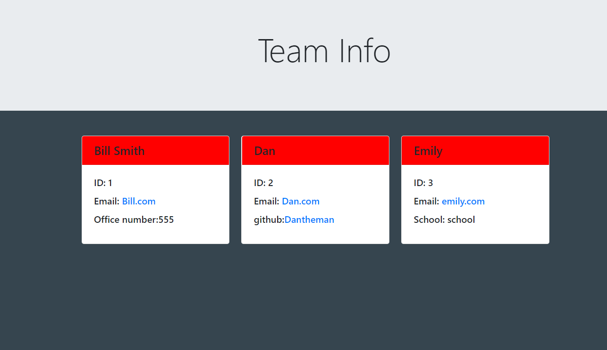

# Team-Profile-Generator

## Description

This program generates team cards with their relevant information. Their are prompts that ask the user information about employees and based off the inputs will generate cards for as many people as the user wants. 

Here is a link to a video as I walk through the steps :
[Youtube](https://youtu.be/f5FA2i7P7bw)

This is a screenshot of what to expect from running the program.



Using prompts brings its own challenge to the table and for this project it was what to show the user based off the first response they give. If they had chosen one of the three employee types than I needed to show a question that was unique to each of them. I show one example below, using the Manager role. If that role was selected than I the prompt would ask them for an office number. However, if they wanted to exit the prompt than I needed to skip the questions and end the prompts. I did this by adding the "when" functionality to the common questions. As long as the user did not select the exit option it would show the common questions.

```javascript
{
        type: 'list',
        name: 'employeeType',
        message: 'What kinda of employee do you want to add?',
        choices: [
            'Manager',
            'Engineer',
            'Intern',
            'Exit'
        ]
    },
    {
        name: 'name',
        message: 'Name of the employee',
        when: (answers) => answers.employeeType !== 'Exit'
    },
    {
        name: 'officeNumber',
        message: 'Employee office number',
        when: (answers) => answers.employeeType === 'Manager'
    },

```

## Installation

Install npm via "npm init". Then you will need to install inquirer by using "npm i inquirer@8.2.4". A folder called node_modules will generate which means you are on the right track. Open your terminal in the root folder and start the program with "node index.js". The prompt will begin and after you fill it out than it will create a file named "index.html" in the src folder.

[Github Repo](https://github.com/johnfrom209/Team-Profile-Generator)

[Youtube Video](https://youtu.be/f5FA2i7P7bw)

## Usage

Once you install the correct components you will be asked to a series of questions. Enter "node index.js" in the cmd line once you are in the root folder. The prompt will begin and after you fill it out and file name "index.html" will show up in the src folder.

## Credits

Uses Node js, inquirer.

## Contact Me

[Linkedin](https://www.linkedin.com/in/johnfrom209/)

[View my Github Repo](https://github.com/johnfrom209)

## License

Refer to the license in the Github repo.